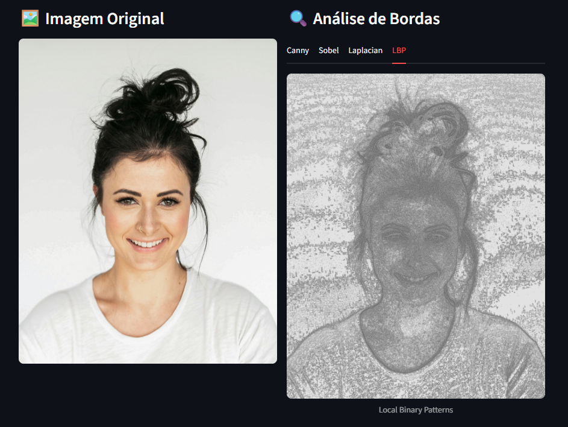
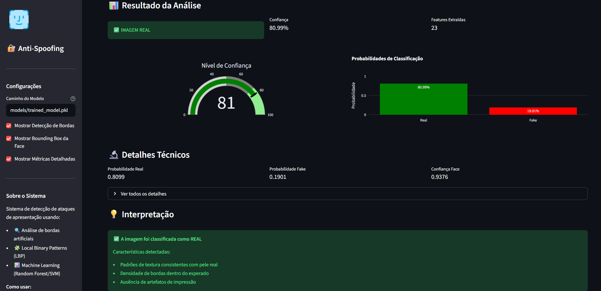
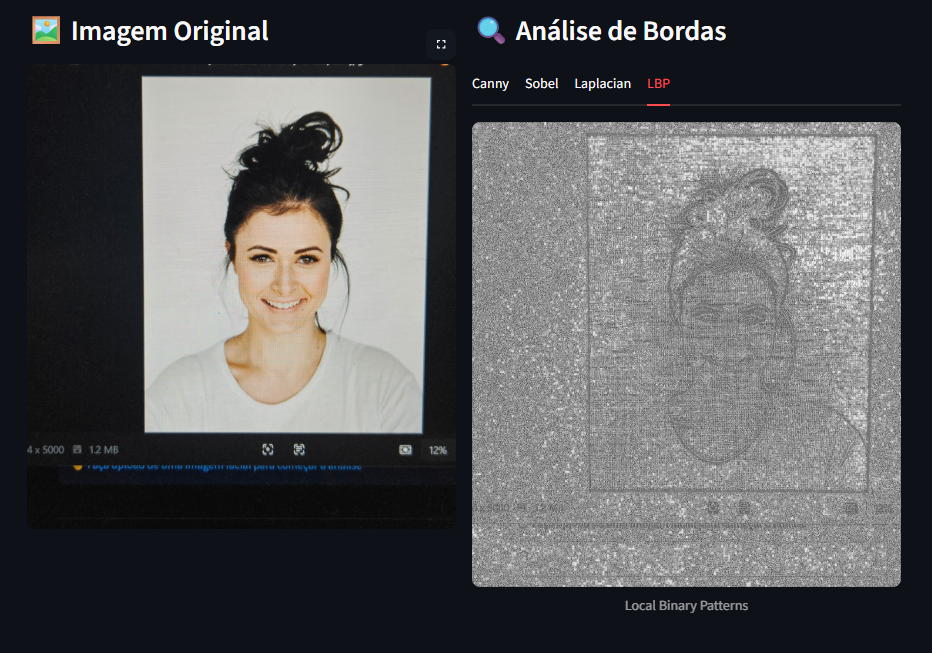
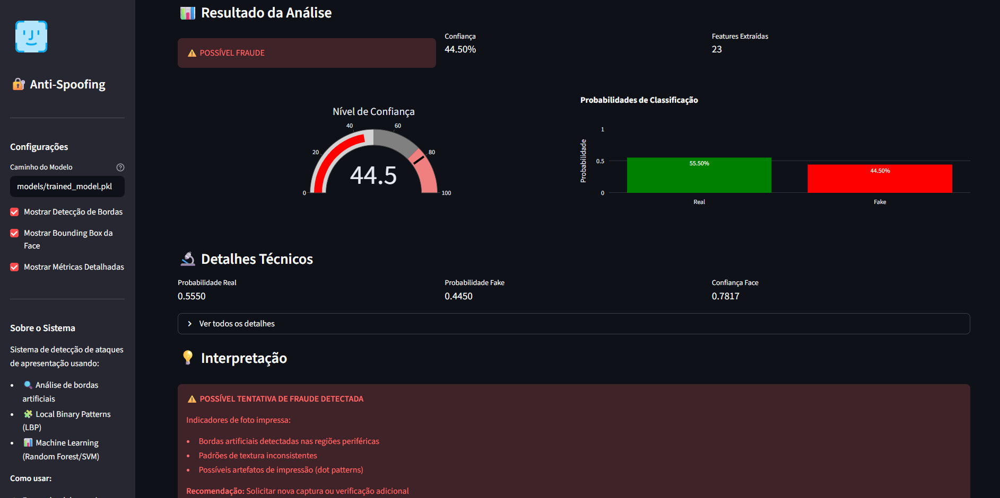

# 🔐 Sistema de Detecção de Ataques de Apresentação Facial

## 📋 Descrição do Projeto

Sistema inteligente para detectar ataques de apresentação (presentation attacks) em sistemas de verificação biométrica facial, identificando tentativas de fraude usando foto de foto através da análise de bordas artificiais e texturas.

**Disciplina:** Sistemas Inteligentes Aplicados  
**Problema:** Vulnerabilidade de sistemas biométricos faciais a fotos impressas e displays digitais  
**Solução:** Classificador baseado em ML clássico que detecta bordas artificiais

---

## 🎯 Objetivo

Desenvolver um MVP funcional que:

- ✅ Detecte automaticamente faces em imagens
- ✅ Extraia features de bordas artificiais, textura e frequência
- ✅ Classifique imagens como "Real" ou "Fake" 
- ✅ Forneça interface web intuitiva com visualizações
- ✅ Apresente score de confiança da detecção

---

## 🏗️ Arquitetura do Sistema

```
Input (Imagem Facial)
    ↓
Detecção de Face (MediaPipe/dlib)
    ↓
Extração de Features:
  - Bordas (Canny/Sobel)
  - Textura (LBP)
  - Sharpness (Laplacian)
  - [Opcional] Análise de Frequência (FFT)
    ↓
Classificador ML (Random Forest / SVM)
    ↓
Output: Real/Fake + Confiança
```

---

## 📂 Estrutura do Projeto

```
presentation-attack/
├── assets/
├── data/
│   ├── raw/                   # Dados originais (separados em fake e real)
│   │   ├── real/
│   │   └── fake/
│   ├── processed/             # Dados processados
│   │   ├── real/
│   │   └── fake/
│   ├── test/                 # Dados de teste
│   │   ├── real/
│   │   └── fake/
│   |── train/                # Dados de treinamento
│   |   ├── real/
│   |   └── fake/
│   └── val/                  # Dados de validação
│       ├── real/
│       └── fake/
├── models/
│   └── trained_model.pkl      # Modelo treinado
├── results/
│    ├── random_forest/        # confusion_matrix, error_rates, feature_importance, metrics_comparison
│    └── svm/                 
├── scripts/
│   ├── data_preparation.py
│   └── train.py
├── src/
│   ├── __init__.py
│   ├── face_detector.py       # Detecção e alinhamento facial
│   ├── feature_extraction.py  # Extração de features (bordas, LBP, etc)
│   ├── classifier.py          # Modelos ML (Random Forest, SVM)
│   ├── utils.py               # Funções auxiliares
│   └── app.py                 # Interface Streamlit
├── requirements.txt
└── README.md
```

---

## 🚀 Instalação

### 1. Clonar o repositório

```bash
cd presentation-attack
```

### 2. Criar ambiente virtual (recomendado)

```bash
python -m venv venv
source venv/bin/activate  # Linux/Mac
# ou
venv\Scripts\activate  # Windows
```

### 3. Instalar dependências

```bash
pip install -r requirements.txt
```

---

## 💻 Como Usar

### Preparar o Dataset
#### Opção A: Dataset Mínimo para Teste (Recomendado para início)

```bash
# 2.1. Criar estrutura de diretórios
mkdir -p data/raw/real data/raw/fake

# 2.2. Adicionar pelo menos 20 imagens de cada classe
# Real: Selfies de pessoas diferentes
# Fake: Fotos dessas selfies impressas e fotografadas
```

**Dica:** Comece com 20-50 imagens por classe para testes rápidos.

#### Opção B: Download de Dataset Público

**NUAA Photograph Imposter Database:**

1. Acesse: [NUAA Photograph Imposter Database](https://parnec.nuaa.edu.cn/_upload/tpl/02/db/731/template731/pages/xtan/NUAAImposterDB_download.html)
2. Baixe o dataset
3. Extraia e separe as fotos por real e fake dentro das pastas em `data/raw/`

---

### Treinamento do Modelo

```bash
# 1. Preparar dados
python scripts/data_preparation.py --dataset_path data/raw --output_path data/processed

# 2. Treinar classificador
python scripts/train.py --data_path data/processed --output_model models/trained_model.pkl
```

### Executar Aplicação Web

```bash
streamlit run src/app.py
```

Acesse: `http://localhost:8501`

---


## 🔬 Técnicas de IA Utilizadas

### 1. **Processamento de Imagem (OpenCV)**

- Detecção de bordas: Canny, Sobel, Laplacian
- Análise de sharpness e nitidez
- Transformada de Fourier (análise de frequência)

### 2. **Extração de Features**

- **LBP (Local Binary Patterns)**: Captura micropadrões de textura
- **Densidade de Bordas**: Identifica bordas artificiais em regiões periféricas
- **Variância Laplaciana**: Mede sharpness e qualidade

### 3. **Machine Learning Clássico**

- **Random Forest**: Ensemble de árvores de decisão
- **SVM**: Support Vector Machine com kernel RBF
- Validação cruzada e otimização de hiperparâmetros

---

## 📊 Datasets

### Datasets Públicos Recomendados:

1. **NUAA Photograph Imposter Database** (~10k imagens)
2. **CASIA-FASD** (~600 vídeos)
3. **Replay-Attack Database**

### Criação de Dataset Próprio:

- Coletar 100-200 fotos reais
- Imprimir e fotografar as mesmas imagens
- Variar iluminação, distância e qualidade

---

## 📈 Métricas de Avaliação

- **Accuracy**: Precisão geral
- **Precision/Recall**: Balanceamento entre falsos positivos/negativos
- **F1-Score**: Média harmônica
- **FAR/FRR**: Taxa de falsos aceites/rejeições


## 🔧 Tecnologias

- **Python 3.8+**
- **OpenCV**: Processamento de imagem
- **scikit-learn**: Machine Learning
- **MediaPipe**: Detecção facial
- **Streamlit**: Interface web
- **NumPy, Pandas, Matplotlib**: Análise de dados

---

## 🌐 Ferramenta Interativa

#### Foto real com análise de features:


#### Resultado da Análise:


#### Foto de tentativa de ataque de apresentação com análise de features:


#### Resultado da Análise:



---

## 🚧 Implementações Futuras

- [ ] Implementar CNN para comparação de performance
- [ ] Adicionar detecção de ataques em vídeo (análise temporal)
- [ ] Otimização para processamento em tempo real
- [ ] Deploy em produção
